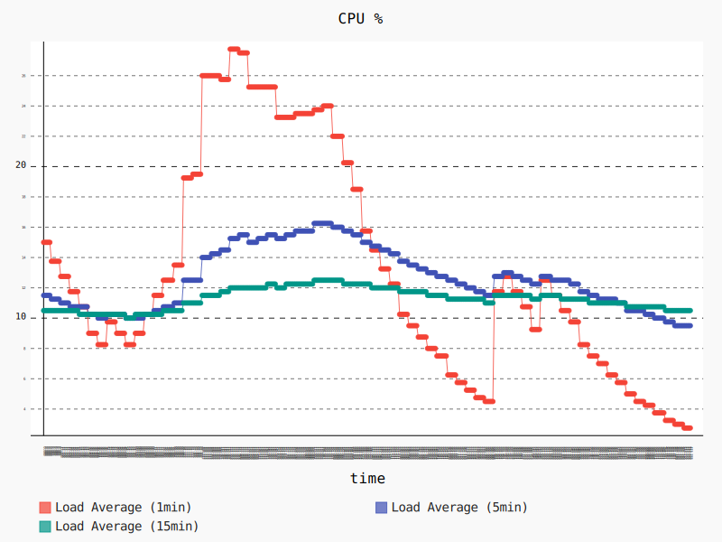
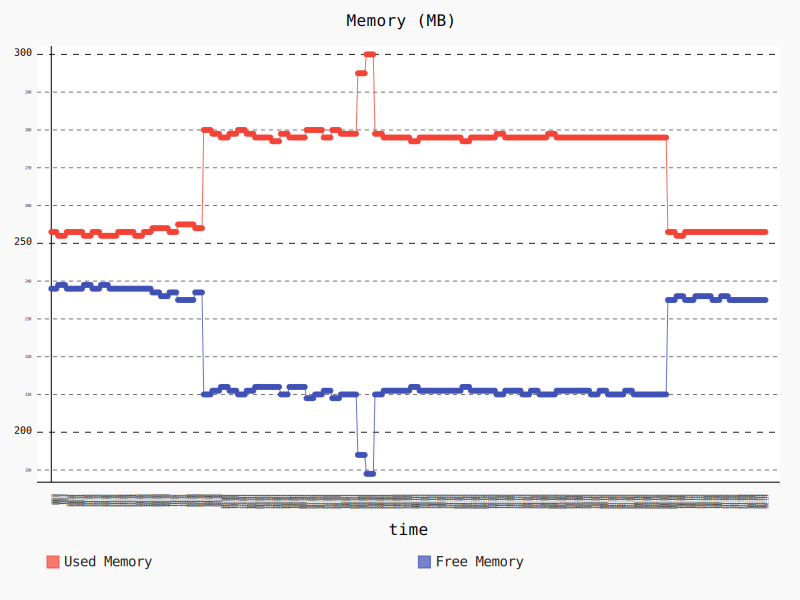

# lex_node


## Overview
The ROS `lex_node` node enables a robot to comprehend natural language commands by voice or textual input and respond through a set of actions, which an AWS Lex Bot maps to ROS messages. Out of the box this node provides a ROS interface to communicate with a specified Amazon Lex bot (configured via lex_config.yaml) and requires configuration of AWS credentials. The Amazon Lex bot needs to be defined with responses and slots for customer prompts. A set of default slots and mappings are demonstrated in the [sample app] and include actions as “Create <location_name>,” “Go to <location_name>” and “Stop.” Additional guides on configuring bots with are available at [Getting Started with Amazon Lex].

Delivering a voice-enabled customer experience (e.g. “Robot, go to x”) will require dialog facilitation, wake word, and offline processing which are not yet provided by this integration. A wake word would trigger the dialog facilitation node to start recording and send the audio to Amazon Lex, then prompt the user for more information should Amazon Lex require it.

The ROS `lex_node`  wraps the [aws-sdk-c++] in a ROS service API.

**Amazon Lex Summary**: Amazon Lex is a service for building conversational interfaces into any application using voice and text. Amazon Lex provides the advanced deep learning functionality of automatic speech recognition (ASR) for converting speech to text, and natural language understanding (NLU) to recognize the intent of the text, to enable you to build applications with highly engaging user experiences and lifelike conversational interactions. With Amazon Lex, the same deep learning technologies that power Amazon Alexa are now available to any developer, enabling you to quickly and easily build sophisticated, natural language, conversational bots (“chatbots”).

### License
The source code is released under an [Apache 2.0].

**Author**: AWS RoboMaker<br/>
**Affiliation**: [Amazon Web Services (AWS)]<br/>
**Maintainer**: AWS RoboMaker, ros-contributions@amazon.com

### Supported ROS Distributions
- Kinetic
- Lunar

### Build status

* Travis CI: [](https://travis-ci.org/aws-robotics/lex-ros1)
 * ROS build farm:
   * v1.0.0:
     * ROS Kinetic @ u16.04 Xenial [](http://build.ros.org/job/Kbin_uX64__lex_node__ubuntu_xenial_amd64__binary)

## Installation

### AWS Credentials
You will need to create an AWS Account and configure the credentials to be able to communicate with AWS services. You may find [AWS Configuration and Credential Files] helpful.

This node requires an IAM User with the following permission policy:
- `AmazonLexRunBotsOnly`

### Building from Source
Create a ROS workspace and a source directory

    mkdir -p ~/ros-workspace/src

To build from source, clone the latest version from master branch and compile the package

- Clone the package into the source directory

        cd ~/ros-workspace/src
        git clone https://github.com/aws-robotics/utils-common.git
        git clone https://github.com/aws-robotics/utils-ros1.git
        git clone https://github.com/aws-robotics/lex-ros1.git

- Install dependencies

        cd ~/ros-workspace && sudo apt-get update
        rosdep install --from-paths src --ignore-src -r -y

- Build the packages
    
        cd ~/ros-workspace && colcon build

- Configure ROS library Path

        source ~/ros-workspace/install/setup.bash

- Build and run the unit tests

        colcon build --packages-select lex_node --cmake-target tests
        colcon test --packages-select lex_node && colcon test-result --all


## Launch Files
An example launch file called `sample_application.launch` is provided.


## Usage

### Resource Setup
1. Go to Amazon Lex
2. Create sample bot: BookTrip
3. Select publish, create a new alias
4. Modify the configuration file in `config/sample_configuration.yaml` to reflect the new alias

### Run the node
- **With** launch file using parameters in .yaml format (example provided)
  - ROS: `roslaunch lex_node sample_application.launch`

### Send a test voice message 
    `rosservice call /lex_node/lex_conversation "{content_type: 'text/plain; charset=utf-8', accept_type: 'text/plain; charset=utf-8', text_request: 'make a reservation', audio_request: {data: ''}}"`

### Verify the test voice was received
- Receive response from Amazon Lex and continue conversation


## Configuration File and Parameters
An example configuration file called `sample_configuration.yaml` is provided. 

**Client Configuration**  
**Namespace**:

| Name | Type |
| --- | --- |
| region | *String* |
| userAgent | *String* |
| endpointOverride | *String* |
| proxyHost | *String* |
| proxyUserName | *String* |
| proxyPassword | *String* |
| caPath | *String* |
| caFile | *String* |
| requestTimeoutMs | *int* |
| connectTimeoutMs | *int* |
| maxConnections | *int* |
| proxyPort | *int* |
| useDualStack | *bool* |
| enableClockSkewAdjustment | *bool* |
| followRedirects | *bool* |

**Amazon Lex Configuration**  
**Namespace**:

| Key | Type | Description |
| --- | ---- | ---- |
| user_id | *string* | e.g. “lex_node” | 
| bot_name | *string* | e.g. “BookTrip” (corresponds to Amazon Lex bot) | 
| bot_alias | *string* | e.g. “Demo” | 


## Performance and Benchmark Results
We evaluated the performance of this node by runnning the followning scenario on a Raspberry Pi 3 Model B:

- Launch a baseline graph containing the talker and listener nodes from the [roscpp_tutorials package](https://wiki.ros.org/roscpp_tutorials), plus two additional nodes that collect CPU and memory usage statistics. Allow the nodes to run for 60 seconds. 
- Launch the ROS `lex_node` using the launch file `lex_node.launch` as described above. At the same time, make calls to the `/lex_node/lex_conversation` service by running the following script in the background: 

```bash
rosservice call /lex_node/set_logger_level "{logger: 'ros.lex_node', level: 'debug'}" 
rosservice call /lex_node/lex_conversation "{content_type: 'text/plain; charset=utf-8', accept_type: 'text/plain; charset=utf-8', text_request: 'Make a reservation', audio_request: {data: ''}}" && sleep 1
rosservice call /lex_node/lex_conversation "{content_type: 'text/plain; charset=utf-8', accept_type: 'text/plain; charset=utf-8', text_request: 'Seattle, WA', audio_request: {data: ''}}" && sleep 1
rosservice call /lex_node/lex_conversation "{content_type: 'text/plain; charset=utf-8', accept_type: 'text/plain; charset=utf-8', text_request: 'Tomorrow', audio_request: {data: ''}}" && sleep 1
rosservice call /lex_node/lex_conversation "{content_type: 'text/plain; charset=utf-8', accept_type: 'text/plain; charset=utf-8', text_request: 'Next Monday', audio_request: {data: ''}}" && sleep 1
rosservice call /lex_node/lex_conversation "{content_type: 'text/plain; charset=utf-8', accept_type: 'text/plain; charset=utf-8', text_request: '40', audio_request: {data: ''}}" && sleep 1
rosservice call /lex_node/lex_conversation "{content_type: 'text/plain; charset=utf-8', accept_type: 'text/plain; charset=utf-8', text_request: 'economy', audio_request: {data: ''}}" && sleep 1 
rosservice call /lex_node/lex_conversation "{content_type: 'text/plain; charset=utf-8', accept_type: 'text/plain; charset=utf-8', text_request: 'yes', audio_request: {data: ''}}"
```

- Allow the nodes to run for 180 seconds. 
- Terminate the ROS `lex_node`, and allow the remaining nodes to run for 60 seconds. 

The following graph shows the CPU usage during that scenario. The 1 minute average CPU usage starts at 15% during the launch of the baseline graph, and stabilizes around 9%. When we launch the `lex_node` node around second 85 the 1 minute average CPU increases up to a peak of 27.75%, and stabilizes around 24% while the `lex_node` node serves the service calls. After that the 1 minute average CPU usage is kept around 12% until we stop the `lex_node` node around second 360. 



The following graph shows the memory usage during that scenario.  We start with a memory usage of around 253 MB for the baseline graph, that increases to a around 280 MB (+10.67%) after launching the `lex_node` node around second 85, and increases again to a peak of 300 (+18.58% wrt initial value) while the `lex_node` node serves the service calls. After that the memory usage decreases to around 278 MB, and keeps this way until going back to 253 MB after we stop the `lex_node` node.




## Node

### lex_node
Enables a robot to comprehend natural language commands by voice or textual input and respond through a set of actions.

#### Services
**Topic**: ~/lex_conversation

#### AudioTextConversation
**Request**:

| Key | Type | Description |
| --- | ---- | ----------- |
| content_type | *string* | The input data type to request Amazon Lex |
| accept_type | *string* | The Amazon Lex output data type desired |
| text_request | *string* | Input text data for Lex |
| audio_request | *uint8[]* | Common audio msg format, input audio data for Lex |

**Response**:

| Key | Type | Description |
| --- | ---- | ----------- |
|text_response | *string* | Output text from Lex, if accept type was text |
|audio_response | *uint8[]* | Output audio data from Lex, if accept type was audio |
|slots | *KeyValuePair[]*| Slots returned from Lex |
|intent_name | *string* | The intent Amazon Lex is attempting to fulfill |
|message_format_type | *string* | Format of output data from Lex |
|dialog_state | *string* | Amazon Lex internal dialog_state |

#### Subscribed Topics
None

#### Published Topics
None


## Bugs & Feature Requests
Please contact the team directly if you would like to request a feature.

Please report bugs in [Issue Tracker].


[Amazon Web Services (AWS)]: https://aws.amazon.com/
[Apache 2.0]: https://aws.amazon.com/apache-2-0/
[AWS Configuration and Credential Files]: https://docs.aws.amazon.com/cli/latest/userguide/cli-config-files.html
[aws-sdk-c++]: https://github.com/aws/aws-sdk-cpp
[Getting Started with Amazon Lex]: https://docs.aws.amazon.com/lex/latest/dg/getting-started.html
[Issue Tracker]: https://github.com/aws-robotics/lex-ros1/issues
[ROS]: http://www.ros.org
[sample app]: https://github.com/aws/aws-robomaker-sample-application-voiceinteraction
